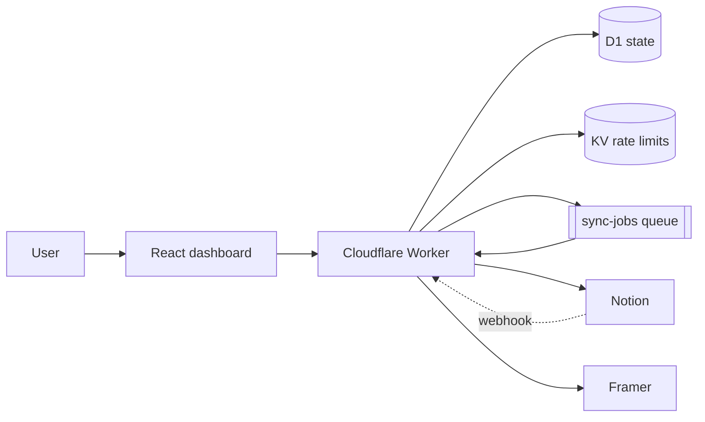

# KnotCMS — System Design Case Study

Written to be cross-examined, not just explained.  
Simple English. Solo build. Meant for portfolio / site reuse.

**Live:** [knotcms.com](https://app.knotcms.com)  
**Role:** Founder & engineer (solo)  
**Stack:** TypeScript · React · Cloudflare Workers · D1 · KV · Queues

**Resume line (decision first):**  
Designed an event-driven sync system that stays reliable under Notion/Framer API pressure by separating request-path manual sync from queued auto-sync, webhook debounce, and trailing publish with cooldowns.

---

## 1. Problem

Updating Framer CMS from Notion by hand is slow and easy to get wrong. Agencies and creators want: connect once, map fields, then trust the backend.

**Not the problem I optimized for:** AI field mapping, multi-tenant enterprise SSO, or a plugin that does the whole setup inside Framer.

**Fork:** build inside a Framer plugin wizard vs a web dashboard with a thin plugin.  
**Chose:** web dashboard. Setup, billing, and sync status need a real app surface. The plugin only opens the dashboard from the canvas (Kitful-style pivot). That kept Framer UX light and put ownership of auth/billing where it belongs.

---

## 2. What I shipped

Notion → mapped fields → Framer CMS, with:

- Google login + Notion OAuth
- Self-serve setup and field mapping
- Manual sync and webhook auto-sync
- Optional auto-publish (preview or live deploy)
- Basic vs paid entitlements and billing webhooks
- Dashboard for status, errors, and settings

Google Sheets → Framer exists in code; public launch flag is still off on purpose.

---

## 3. Numbers I can defend (and ones I cannot)

I do not have a polished ops dashboard with p95 sync latency yet. Lying about that would tank the rest. Here is what is real today.

### Designed / coded limits (from product + worker config)

| Thing | Value | Why it exists |
|-------|------:|---------------|
| Basic projects | 1 | Free tier guardrail |
| Basic lifetime manual syncs | 3 | Force paid for real use |
| Basic rows per sync / import | **50** | Hard cap after full source fetch |
| Framer → Notion import / bootstrap rows | **500** | Hard cap on sequential Notion creates |
| Paid Notion → Framer sync row cap | **None in code** | See §5 — open risk |
| Webhook debounce quiet window | **10 seconds** | Collapse edit bursts |
| Debounce safety wait cap | **70 seconds** | Stuck timer cannot block forever |
| Publish cooldown (preview) | **3 minutes** | Framer publish rate reality |
| Publish cooldown (live deploy) | **5 minutes** | Same, stricter |
| Sync queue retries | **5**, delay **60s** | Retryable failures only |
| Queue batch size | **1** | One project job at a time per message |
| Burst rate limits | Plan-based / 60s window | e.g. Basic manual sync **2/min**; paid base **7/min**, scales with seats |

### Measured production metrics

**Not published yet.** No honest p95, error rate, or cost-per-sync number I can put here without inventing it.

**What I will measure next (and add to this page):** largest successful inline sync row count, p95 `runSync` duration, % of syncs ending in retryable vs permanent errors, Worker CPU ms on the largest fixture.

Until then, treat everything below as **architecture under real API constraints**, not a load-test report.

---

## 4. Architecture (one diagram)

| Piece | Job | Rejected alternative |
|-------|-----|----------------------|
| **Worker** | API, OAuth, webhooks, sync, serves SPA | Separate API + static host — more deploy surface for a solo app |
| **D1** | Customers, projects, mappings, sync/debounce state | “Everything in KV” — bad for relational project state |
| **KV** | Burst rate-limit counters | D1 for counters — slower and heavier for hot increments |
| **Queue** | Auto-sync + trailing publish | Cron every minute — we tried that path; see scars |
| **Shared package** | Transforms, plans, types | Duplicate logic in web and worker — drift risk |

---

## 5. The hard path: sync — and the open ceiling

### Pipeline

1. Load project, mappings, secrets  
2. Fetch source (Notion pages or sheet rows)  
3. Transform to Framer items  
4. Connect Framer Server API  
5. Reconcile collection (add / update / remove)  
6. Write sync state  
7. If auto-publish → schedule **trailing publish** (not publish inside the sync)

### Fork: full reconcile vs delta sync

**Chose full reconcile first.** Correctness is easier to reason about when Framer and Notion can drift. Delta sync would be less write-heavy at scale; I have not built it yet. That is a deliberate debt, not a claim that reconcile is “best forever.”

### Fork: inline manual sync vs queue everything

**Chose:**

- **Manual sync / create / reconfigure** → `runSync` **inside the HTTP request** so the UI gets a clear success or failure.
- **Webhook auto-sync** → debounce, then **queue**.

**Why not queue manual sync too?** Worse UX for “did it work?” and harder error display unless I build job polling. Fair trade for small/medium sources. Weak trade for huge paid sources — see below.

### Ceiling — closing the loop (honest)

| Path | Cap | Runs where |
|------|----:|------------|
| Basic Notion → Framer | **50 rows** written (source may be larger; we slice) | Inline request |
| Framer → Notion import/bootstrap | **500 rows** | Inline request |
| Paid Notion → Framer | **No code cap** | **Still inline** |

**What happens at a few thousand paid rows today?**  
The request stays on the Worker and does the full fetch + transform + Framer rewrite. Cloudflare Workers still have CPU/duration limits. I have **not** measured the exact row count where inline `runSync` fails in production. There is **no** “above N, spill to queue” switch yet.

That is the weakest part of the design relative to the constraint I named.  

**What I would ship next for this hole:**

1. Hard safety cap or streamed/chunked Framer writes for paid inline sync  
2. Or: enqueue paid syncs over a threshold and poll job status in the UI  
3. Fixture load test: 100 / 500 / 2k / 5k rows → record CPU ms, wall time, failure mode

Until that exists, the accurate statement is: **reliability work focused on webhooks and publish; the large paid inline reconcile is an accepted risk, not a solved one.**

---

## 6. Reliability that *did* come from getting burned

These are not “nice features.” They are scars.

### Scar 1 — Debounce, or you sync twice (or twenty times)

Notion can fire many webhooks for one editing session. Early design leaned on a **cron** to drain debounce rows. That is fragile: timing races and “clear debounce so cron does not double-sync” showed up in the code path for a reason.

**Now:** first event in a burst enqueues one queue job; later events only push `scheduled_at` forward by **10s**. The queue consumer waits for the quiet window (capped at **70s**), clears debounce, then syncs. Cron triggers were removed so deploys cannot leave a stale `*/1` job double-driving sync.

**Skeptic question:** can two jobs still overlap?  
**Answer:** D1 sync lock rejects overlapping sync with `SYNC_IN_PROGRESS`. Not perfect distributed locking — good enough for one project’s burst.

### Scar 2 — Publish is not part of sync

Publishing live on every CMS write hits Framer’s “Publishing unavailable” behavior.  

**Now:** sync only updates CMS. Auto-publish marks “pending” and schedules a **trailing publish** job that waits for:

- debounce quiet (edits still landing), and  
- cooldown: **3 min** preview / **5 min** live deploy  

Failed publish reasons are stored separately from sync errors so the dashboard does not lie about “sync failed” when only deploy was blocked.

### Scar 3 — Framer asset uploads fail in the wild

`addItems` can fail on remote image import / asset upload / 429. Blind retry was not enough.

**Now:** retry with backoff on retryable Framer errors; if it still fails as an asset error, **strip image field values and retry once** so text/CMS structure still lands. Incomplete, but better than failing the whole sync because one image URL blew up.

### Scar 4 — Product surface pivot

V1 energy went into a Framer plugin wizard. Real publishing (auth, billing, long-running sync) does not fit that box.

**Redo:** thin plugin, fat dashboard. Cost: rewrite of user journey. Benefit: architecture matches how people actually buy and operate the product.

### Scar 5 — Entitlements after billing reality

Paid features are not “if plan_id == paid.” Subscription can lapse; seat count can change. Effective plan can fall back toward Basic quotas while billing UI still knows the stored plan. Feature gates (`autoSync`, `autoPublish`) and sync quota checks throw typed `PLAN_LIMIT` / `LICENSE_INACTIVE` errors that the queue **does not retry** — retrying a plan limit only burns money and log noise.

---

## 7. Error handling (without overclaiming)

Sync errors are **classified** (plan limit, unauthorized, in progress, retryable network, etc.).

- Dashboard shows last sync error (error **surfacing**)  
- Queue retries only retryable codes  
- Cloudflare Worker **logs and traces** are enabled in wrangler; that is not a full metrics/alerting stack  

I am not calling the dashboard “observability.” Observability here means: typed failures + logs/traces + state the user can see. No SLO burn alerts yet.

---

## 8. Auth and billing (short, defensive)

**Auth fork:** magic links vs Google OAuth.  
**Chose Google** — low friction for creators; session is a signed HTTP-only cookie. Login does not equal paid access.

**Billing:** provider adapter (`polar` / `dodo` / manual) behind one webhook route so MoR choice does not fork the whole app. Seats map to `subscription_project_limit`.

---

## 9. Tradeoffs I would defend in an interview

| Decision | Chose | Not | Why |
|----------|-------|-----|-----|
| Manual sync placement | Inline | Always queue | Clear UX; risky at huge paid size — open issue |
| Auto sync placement | Queue + debounce | Inline in webhook | Webhooks must be fast; bursts must collapse |
| Publish | Trailing + cooldown | Publish inside sync | Framer rate reality |
| State stores | D1 + KV | One store | Different access patterns |
| Collection write | Full reconcile | Delta | Correctness first; scale later |
| Language | TypeScript | Rust Worker rewrite | Work is I/O-bound to Notion/Framer; rewrite would not buy much until CPU is the proven bottleneck |

---

## 10. What I would redo / build next

1. **Close the paid inline ceiling** — threshold → queue + job status UI, or chunked writes + hard safety cap.  
2. **Publish one measured number** — largest sync fixture + p95 duration + failure mode.  
3. **Delta sync** once reconcile cost shows up in metrics.  
4. **Alerting** on sync error rate / queue DLQ — logs alone are not enough.  

---

## 11. What I owned

Solo: problem framing, Cloudflare architecture, OAuth, sync engine, webhook debounce, publish cooldown, entitlements, billing adapter, dashboard/setup UX, deploy.

---

## 12. Site blurb (short)

KnotCMS is a Notion → Framer CMS sync product I built end to end on Cloudflare. The interesting part is not the feature list — it is keeping sync trustworthy when Notion floods webhooks and Framer rate-limits publish: debounce + queue for auto-sync, sync lock, classified errors, and trailing publish with 3–5 minute cooldowns. Manual sync still runs inline for UX; paid uncapped reconcile on the request path is a known ceiling I have not load-tested yet.

---

## Honesty box

- **Have:** real product architecture, coded limits, scars reflected in code comments and design pivots.  
- **Do not have yet:** published p95, error %, cost/sync, or a measured “breaks at N rows” number for paid inline sync.  
- **Do not pretend:** dashboard errors ≠ full observability; full reconcile ≠ solved scale.
